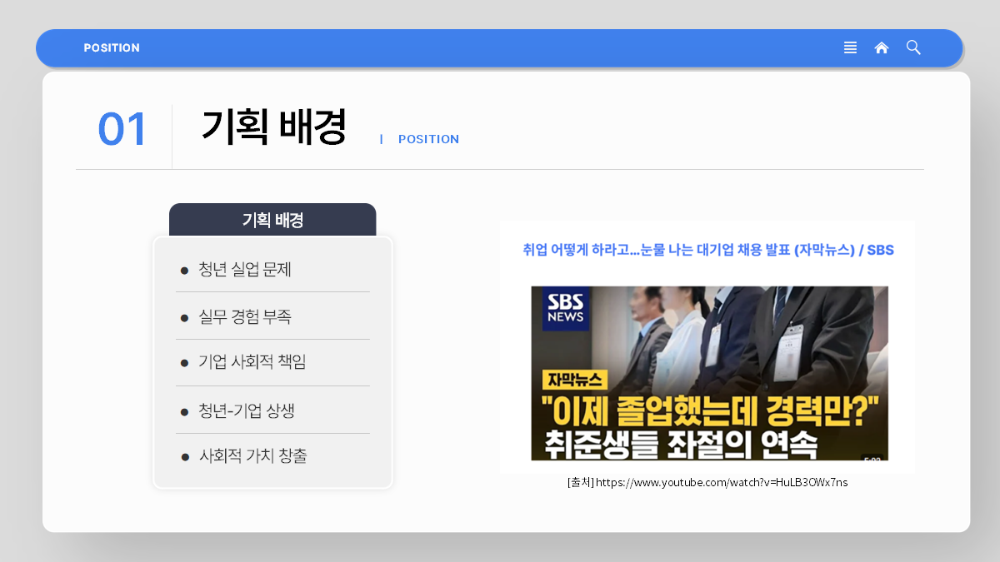
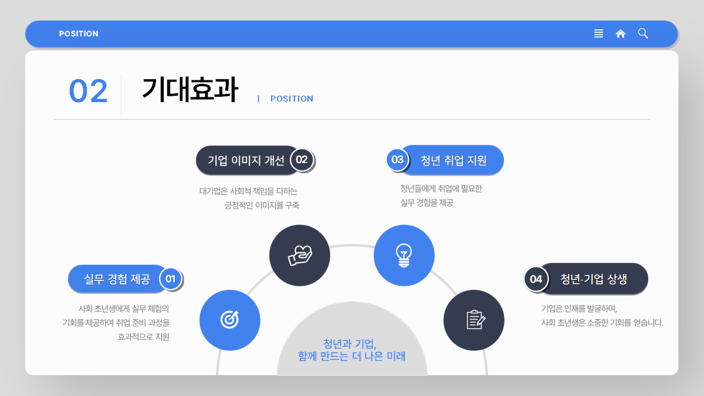
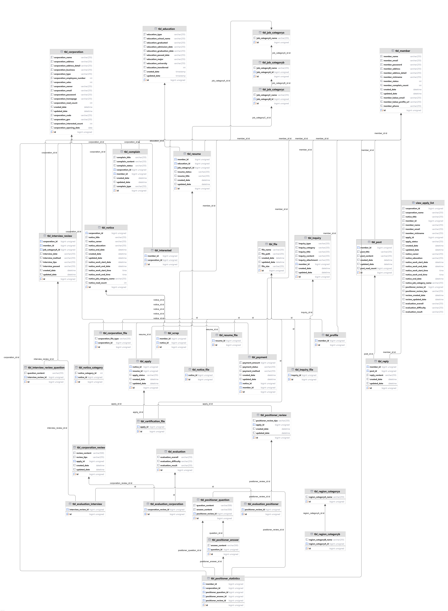
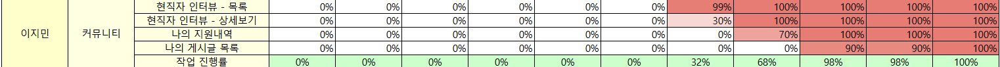
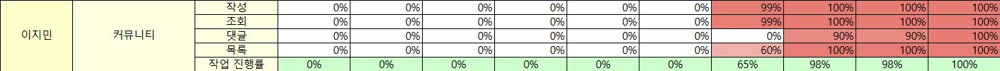

<h1>Jimin-Position</h1>
 
<h1>기업-청년 매칭 플랫폼 '포지션'</h1>

<h2>1. 기획의도</h2>
<h3>1. 서비스 제작배경 및 필요성</h3>
<h4>1-1 서비스 제작 배경</h4>

<strong>"졸업했는데 경력만?"</strong>이라는 기사를 통해 알 수 있듯, 많은 청년들이 취업 준비 과정에서 실무 경험 부족이라는 큰 벽에 직면하고 있습니다. 경험이 없어 취업이 어렵고, 취업이 어려워서 경험을 쌓을 기회조차 얻지 못하는 악순환이 반복되고 있습니다.

이와 함께 최근 대기업들은 단순한 이윤 창출을 넘어 사회적 책임을 다하려는 움직임을 보이고 있습니다. 청년 취업 지원 활동을 통해 <strong>긍정적인 브랜드 이미지를 구축</strong>하고, 사회 문제 해결에 기여하고자 하는 노력이 두드러집니다.

저희는 이러한 점에 주목하여 청년과 기업 간의 상생을 실현하고자 합니다. 기업은 정직원의 업무를 체험단에게 제공함으로써 비용을 절감하고, 청년들은 <strong>실무 경험과 이력서에 기재할 수 있는 경력을 쌓는 기회</strong>를 얻게 됩니다. 이를 위해, 저희는 사회 초년생들에게 <strong>실질적인 실무 경험과 경력을 제공</strong>하고, 취업 시장에서 경쟁력을 높일 수 있는 실무 체험 프로그램을 기획했습니다.
<h2>2. 기대효과</h2>

<strong>[실무 경험 제공]</strong> 
사회 초년생들은 실질적인 업무를 통해 자신감을 얻고, 이력서에 기재할 수 있는 실무 경험을 확보하게 됩니다. 이를 통해 취업 시장에서 경쟁력을 갖추고 경력의 빈칸을 채울 수 있습니다.

<strong>[기업 이미지 개선]</strong> 
기업은 청년 취업 지원을 통해 사회적 책임을 다하는 모습을 보여줌으로써 긍정적인 브랜드 이미지를 구축하고, 사회적 가치를 창출하는 기업으로 평가받을 수 있습니다.

<strong>[청년 취업 지원</strong>] 
이 프로그램은 청년들에게 취업에 필요한 실무 경험을 제공하여, 단기적으로는 취업 준비 과정의 부담을 완화하고 장기적으로는 청년 실업 문제 해결에 기여합니다.

<strong>[청년과 기업 상생]</strong> 
기업은 이 프로그램을 통해 인재를 쉽게 찾을 수 있고, 사회 초년생들은 실무 경험을 쌓을 기회를 얻게 됩니다. 이렇게 상생하는 구조는 기업의 인력 채용과 청년들의 경력 개발을 동시에 촉진합니다.

<h2>3. 프로젝트 사용 툴</h2>
<ul>
    <li>Java</li>
    <li>Java Spring Data</li>
    <li>QueryDSL</li>
    <li>Java Script</li>
    <li>Tomcat</li>
    <li>jQuery</li>
    <li>MySQL</li>
    <li>Spring Boot</li>
    <li>Visual Studio Code</li>
    <li>DBeaver</li>
    <li>Sourcetree</li>
    <li>Git, GitHub</li>
    <li>JSON</li>
    <li>Ajax</li>
    <li>JDK 17.0.10</li>
    <li>Kakao DEVELOPER API</li>
    <li>Kakao Map API</li>
    <li>Boot Pay</li>
    <li>Slack</li>
</ul>
<h2>4. ERD</h2>

<h2>5. 담당업무</h2>
5-1 프론트엔드

▶커뮤니티
<ul>
 <li>현직자 인터뷰 - 목록</li></li>
 <li>현직자 인터뷰 - 상세보기</li>
 <li>나의 지원내역</li>
 <li>나의 게시글 목록</li>
</ul>

5-2 백엔드

▶커뮤니티 작성
<ul>
 <li>사용자가 커뮤니티를 작성할 수 있음</li>
 <li>로그인 세션이 담겨야만 작성 가능 없을 시, 로그인 페이지로 리다이렉트</li>
</ul>
▶커뮤니티 조회
<ul>
 <li>작성된 내용을 출력</li>
 <li>사용자가 작성한 게시글일 시, 삭제 기능 제공</li>
</ul>
▶커뮤니티 목록
<ul>
 <li>작성된 커뮤니티 목록을 5개 가져오고 페이징(Rest)</li>
 <li>검색 기능 제공</li>
 <li>조회순, 최신순, 댓글순 필터 제공</li>
</ul>
▶커뮤니티 댓글
<ul>
 <li>작성된 댓글 5개 조회 후 더보기 버튼으로 페이징(Rest)</li>
 <li>댓글 작성 가능</li>
 <li>사용자가 작성한 댓글일 시 수정 가능, 수정 버튼 클릭 후 저장 버튼으로 바뀌고 저장 시 수정 완료</li>
 <li>사용자가 작성한 댓글일 시 삭제 가능</li>
</ul>
